Welcome to

# 🦸🏻‍♀️ Super Squad 🦸🏼‍♂️
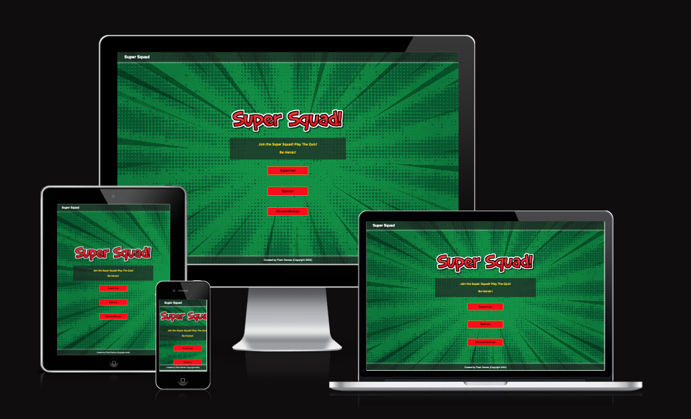

[View the live project here!] (https://gemmabutcher-dev.github.io/ms2/)

## Table of Contents
1. [UX](#ux)

  * Project Goals
  * User Goals 
  * Design Choices
  * Wireframes

2. [Features](#features)

   * Header Area
   * Game Area
   * Multi-Choice Questions
   * Timer
   * Modal
   * Results Feature
   * Restart Quiz Button
   * Sound Button
   * 404 Page
   * Features left to implement

3. [Technologies used](#technologies-used)

  * Languages Used
  * Frameworks, Programs and Libraries Used

4. [Deployment](#deployment)

  * GitHub Pages
  * Forking the GitHub Repository
  * Making a Local Clone

5. [Credits](#credits)

  * Content
  * Media
  * Code
  * Acknowledgements

------

## UX

### User Stories

#### Project Goals

The target audience is for all users aged 7 and above or younger children with a Knowledge and interest in learning about superheros by playing a immersive trivia game with audio and visual feedback.

#### User Goals

"**_As a user, I would like to_** _______________"

✅  test my knowledge of superheroes.

✅  be able to start a new quiz game.

✅  answer multiple choice questions by selecting what i think is the correct answer.

✅  get immediate feedback to know if I have selected the correct answer or selected a     
    incorrect answer.

✅  go to the next question after recieving feedback from the current one so I can continue to play the 
    quiz and increase my knowledge base.

✅  know if i have a time restriction and what time i have left to answer a question or complete the quiz.

✅  see my final score at the end of the quiz to know how good my knowledge is.

✅  be able to restart the quiz to attempt the quiz again and improve my score.

✅  find the quiz to be engaging and fun with relevant images and sound.

✅  find the experience immersive and cinematic.

✅  be able to turn on and off all sounds throughout the game by locating a sound button.


### Design Choices

   * Mobile first, single column responsive design. 

#### Colour Scheme

 The global colour selection for Super Squad is shown below.

 * red #ff0000
 * white #ffffff
 * black #000000
 * yellow #ffd700

#### Typography

   * The Exo+2 google font with a fall back font of sans-serif should the font fail to load. It is used for the header logo text, introduction text and footer.
   * Supernova 2 font from cdn fonts is used for the game selection buttons text with a fall back font of sans serif should it fail to load. This font has a fun and slightly dramatic comic characteristics whilst remaining legible. 

#### Imagery

A range of imagery is used from free background images at [freepik](https://www.freepik.com/) to using [leonardo AI](https://app.leonardo.ai/image-generation) to create superhero and villain images to create something unique and effective, bespoke to this project.

The below image was created using Leonardo AI.

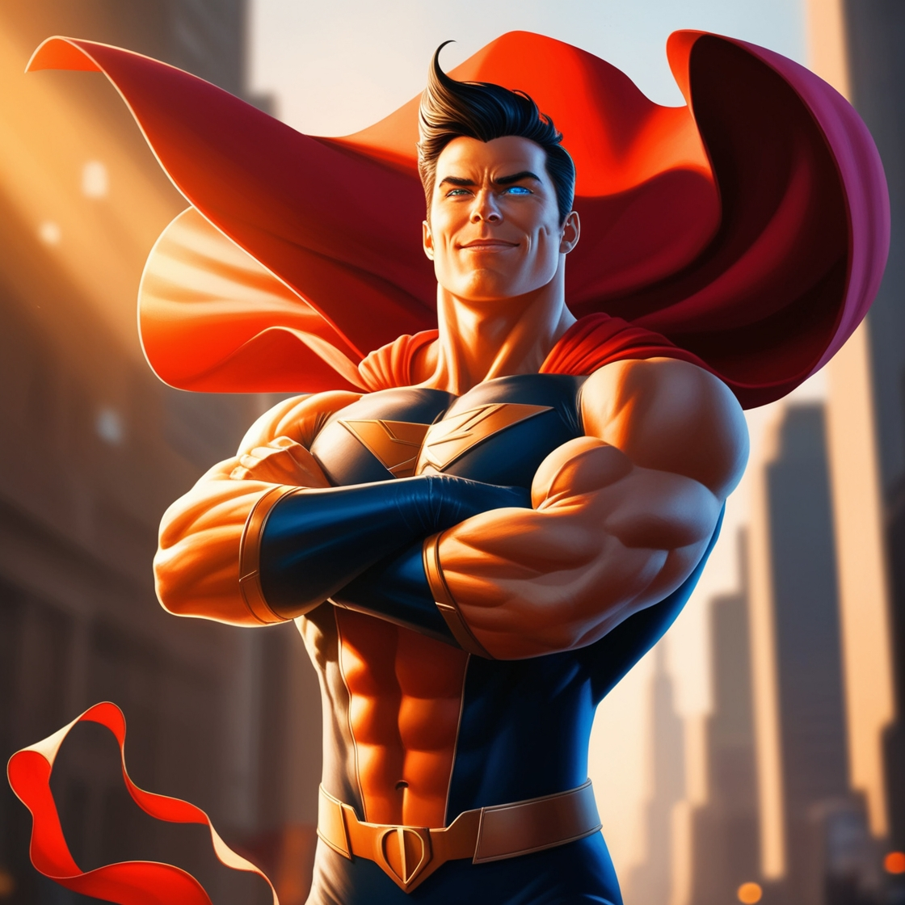

### Wireframes

Wireframes were created using balsamiq and can be found in the [wireframes folder](docs/wireframes).
Below is the mobile view wireframe of the homepage.

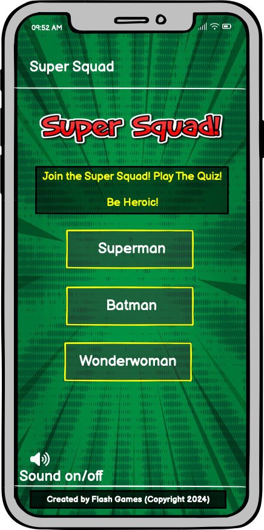
------
The wireframe shwoing the modal pop up is shown below.

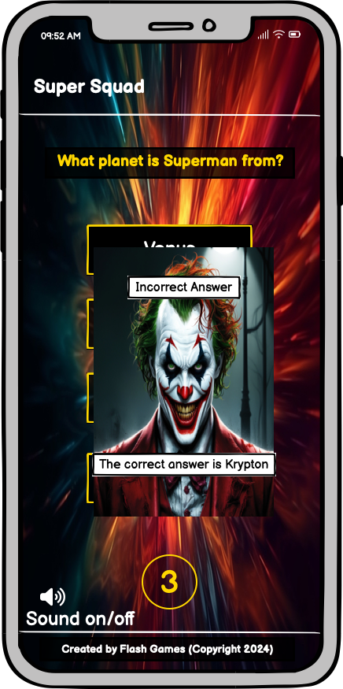

## Features

### Existing Features

   #### Game Area

   * The home page largely consists of a game area which presents 3 choices of superhero game topic to the user. The choices are Superman, Batman or Wonderwoman. There are hero appropriate sound effects when a theme button is clicked.

    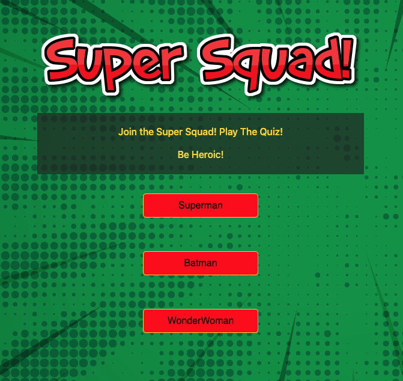

   #### Multi-Choice Questions

   * After selecting a specific superhero topic the user is then presented with their first multi-choice question. The user is given 10 seconds to select an answer shown in a countdown timer. A superhero theme audio is played throught the game in a loop.

   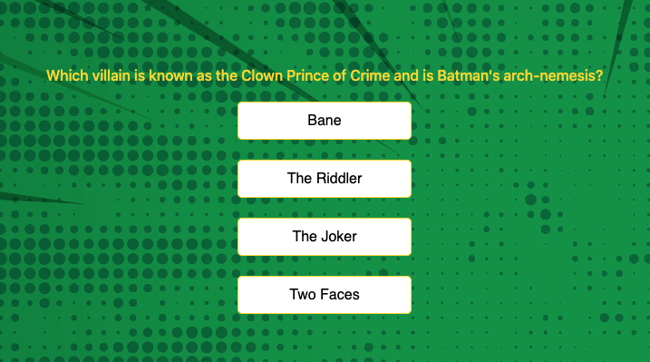

   #### Timer

   * The countdown timer shows the user how much time they have to answer the questions and counts down from 10 to 0. The timer resets for each question.

   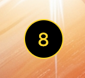

   #### Modal

   * A modal appears when the user selects an answer and will let the user know if they were correct or not and what the correct answer was. If the user does not select a question within the given 10 second time limit the modal will inform the user that they are out of time. The background image changes depending on whether the user is correct, incorrect or out of time. This is shown below.

| Modal            | Example Image                                        |
|------------------|------------------------------------------------------|
| correct answer   | 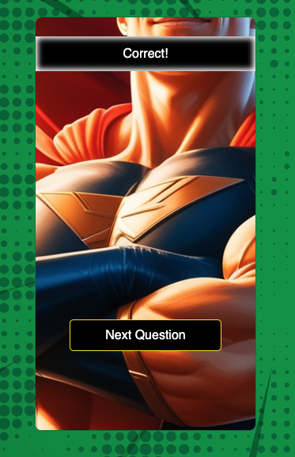 |
| incorrect answer | 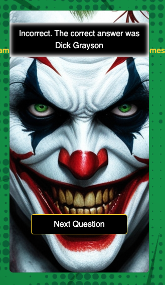    |
| time is up       | 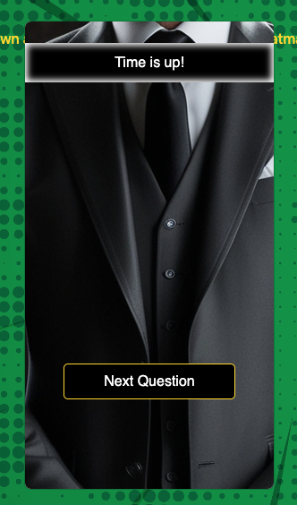               |


   #### Results Feature

   * On completion of the quiz the user is presented with a results page stating their score out of the 5 questions that they answered. The results page has an image and sound clip dependending on their score. If they get 5/5 correct they will be shown an image of superman and superman soundclip with their score above. If the score 3/5 or 4/5 they will get an image and sound clip of the joker with their score above. if the user scores less than 3/5 they will be shown an image of lex luther and a sound clip with score above. 

| Score      | Example Image                                    | Sounds                                                   |
|------------|--------------------------------------------------|----------------------------------------------------------|
| 0/5 - 2/5  | 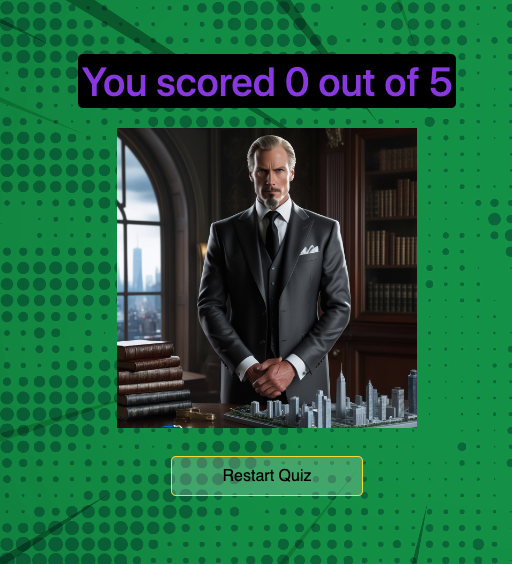 |  |
| 3/5 & 4/5  | 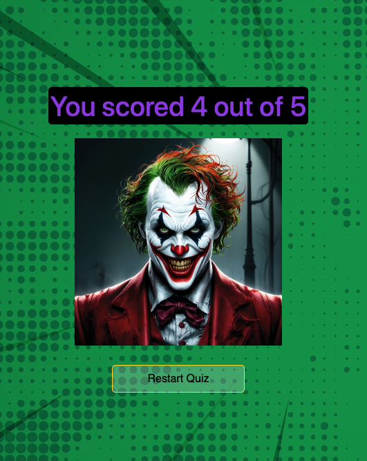       |  |
| 5/5        | 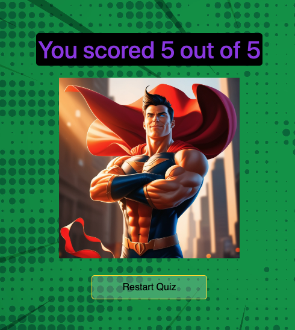   |            |

   #### Restart Quiz Button

   * A restart button is located underneath the results image that takes the user back to the game selection options.

   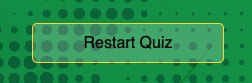

   #### Sound Button

   * A sound button, set to muted/off by default, is clearly labelled in the bottom left of the game area.

   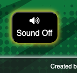

   #### 404 Page

   * A 404 page is navigated to when an error occurs or the website wont load. The page explains to the user that there is an issue and offers a button to navigate back to the homepage/index.html without using browser buttons.

   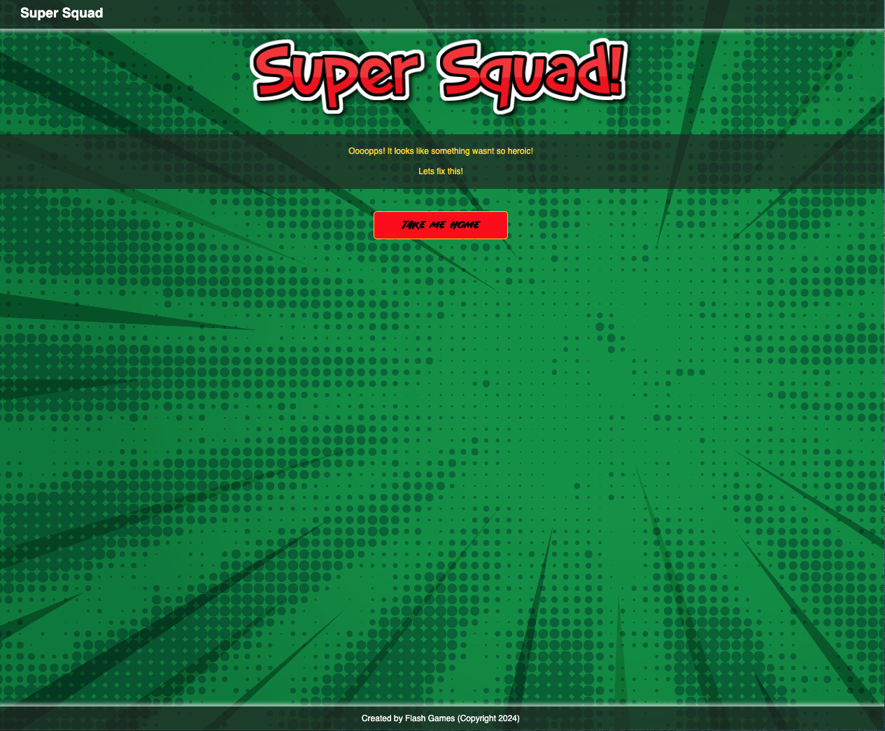

### Features Left To Implement

   * Scoreboard of top 10 highest scores with player username stored.
   * Additional superhero specific themes.
   * About the gaming company page.
   * Contact Form.

## Technologies Used

### Languages Used

 * [CSS3](https://en.wikipedia.org/wiki/Cascading_Style_Sheets)
 * [HTML5](https://en.wikipedia.org/wiki/HTML5)
 * JavaScript

### Frameworks, Programs and Libraries Used

1. [Bootstrap 5.3](https://getbootstrap.com/):
   Bootstrap was used to assist with the responsiveness and styling of the website.
2. [Google Fonts](https://fonts.google.com/):
   Google fonts were used to import the 'Exo+2' font into the index.html and style.css files which is used on all pages throughout the project.
3. [Font Awesome](https://fontawesome.com/):
   Font Awesome was used on all pages throughout the website to add icons for aesthetic and UX purposes.
4. jQuery:
   jQuery came with Bootstrap to make the navbar responsive but was also used for the smooth scroll function in JavaScript.
5. [Git](https://git-scm.com/):
   Git was used for version control by utilizing the Gitpod terminal to commit to Git and Push to GitHub.
6. [GitHub](https://github.com/):
   GitHub is used to store the projects code after being pushed from Git.
7. [Balsamiq](https://balsamiq.com/):
   Balsamiq was used to create the wireframes during the design process.
8. [Am i responsive?](https://ui.dev/amiresponsive):
   Am i reponsive was used to create the device mockup in README.md.
9. [ahrefs](https://ahrefs.com/writing-tools/img-alt-text-generator):
   ahrefs was used to help generate alt text for images.
10. [Canva](https://www.canva.com/colors/color-palette-generator/):
    Canva's logo generator was used to create a logo for the favicons.


## Deployment

### GitHub Pages

The project was deployed to GitHub Pages using the following steps...

1. Log in to GitHub and locate the [GitHub Repository](https://github.com/GemmaButcher-dev/freestyle_dance.git)
2. At the top of the Repository (not top of page), locate the "Settings" Button on the menu.
    - Alternatively Click [Here](https://raw.githubusercontent.com/) for a GIF demonstrating the process starting from Step 2.
3. Scroll down the Settings page until you locate the "GitHub Pages" Section.
4. Under "Source", click the dropdown called "None" and select "Master Branch".
5. The page will automatically refresh.
6. Scroll back down through the page to locate the now published site [link](https://gemmabutcher-dev.github.io/freestyle_dance/) in the "GitHub Pages" section.

### Forking the GitHub Repository

By forking the GitHub Repository we make a copy of the original repository on our GitHub account to view and/or make changes without affecting the original repository by using the following steps...

1. Log in to GitHub and locate the [GitHub Repository](https://github.com/GemmaButcher-dev/freestyle_dance.git)
2. At the top of the Repository (not top of page) just above the "Settings" Button on the menu, locate the "Fork" Button.
3. You should now have a copy of the original repository in your GitHub account.

### Making a Local Clone

1. Log in to GitHub and locate the [GitHub Repository](https://github.com/GemmaButcher-dev/freestyle_dance.git)
2. Under the repository name, click "Clone or download".
3. To clone the repository using HTTPS, under "Clone with HTTPS", copy the link.
4. Open Git Bash
5. Change the current working directory to the location where you want the cloned directory to be made.
6. Type `git clone`, and then paste the URL you copied in Step 3.

```
$ git clone https://github.com/GemmaButcher-dev/freestyle_dance.git
```

7. Press Enter. Your local clone will be created.

```
$ git clone https://github.com/GemmaButcher-dev/freestyle_dance.git
> Cloning into `CI-Clone`...
> remote: Counting objects: 10, done.
> remote: Compressing objects: 100% (8/8), done.
> remove: Total 10 (delta 1), reused 10 (delta 1)
> Unpacking objects: 100% (10/10), done.
```

Click [Here](https://help.github.com/en/github/creating-cloning-and-archiving-repositories/cloning-a-repository#cloning-a-repository-to-github-desktop) to retrieve pictures for some of the buttons and more detailed explanations of the above process.

## Credits

### Code

  * [Bootstrap4](https://getbootstrap.com/docs/4.4/getting-started/introduction/): Bootstrap Library used throughout the 
    project mainly to make site responsive using the Bootstrap Grid System. Also used for hero image and carousel. text-white and text-black classes used for styling.
  * [Google Developer Tools](https://developer.chrome.com/docs/devtools) : For problem solving with layout and managing css 
    overrides.
  * [ahref](https://ahrefs.com/writing-tools/img-alt-text-generator) : For image alt text.
  * Favicon sitemanifest and header tags was provided by [Favicon Generator](https://favicon.io/)

### Content

  * All content was designed by the developer. 
  * Trivia questions were sourced from [ChatGPT](https://openai.com/index/chatgpt/)

### Media

  * All background images were sourced at [freepik](https://www.freepik.com/)
  * Hero theme audio was sourced at [uppbeat](https://uppbeat.io/music/theme/superhero)
  * Super Hero and villain images were created using image generation at [Leonardo AI](https://app.leonardo.ai/image-generation)
  * Button and result page audio was sourced at [My Instants](https://www.myinstants.com/)
  * Super Squad image title was created at [Flaming Text](https://eu1.flamingtext.com/)
  * Favicon icons and png files were generated by [Favicon Generator](https://favicon.io/)

### Acknowledgements

  * My Mentor for continuous helpful feedback.
  * Cohort Leader Rachel Furlong for her continued support.
  * Tutor support at Code Institute for their support.