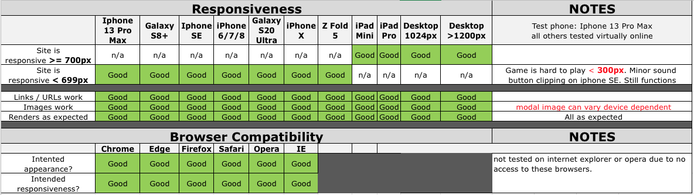
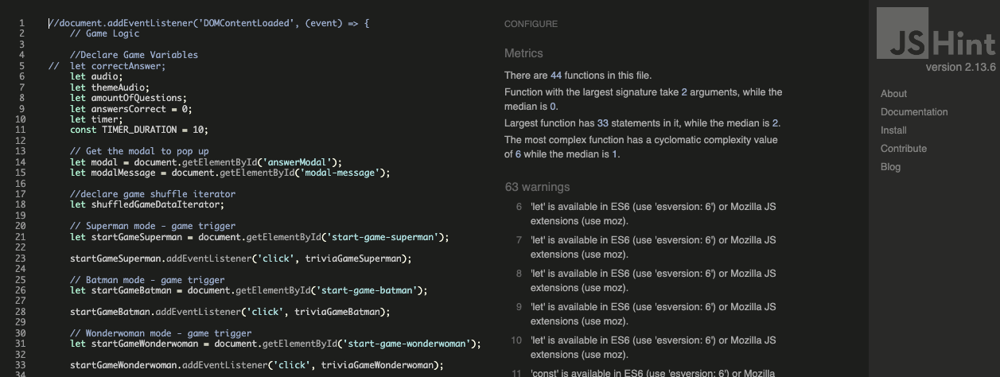
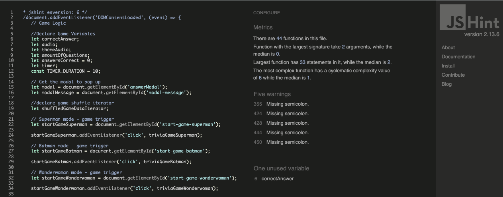
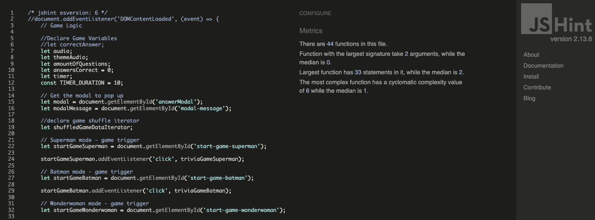

 #[Testing](#testing)

## Table of contents

  1. [Overall Peformance](#overall-performance)
  2. [Code Validation](#code-validation)
  3. [Accessibility Testing](#accessibility-testing)
  4. [Responsiveness & Compatability Testing](#responsiveness--compatability-testing)
  5. [JavaScript Testing](#javascript-testing)
        * JS Hint
  6. [Bug Fixes](#bug-fixes)
        * Sound Button
        * Game Over Audio
  7. [Testing User Stories from User Experience (UX) Section](#testing-user-stories)
        * Project Goals
        * Players Goals
        * Super Squad helps players meet these goals by:
  8.  [Other Testing Methods](#other-testing)
  9. [Further Testing](#further-testing)

  ------

## Overall Performance

The complete site was tested on the lighthouse facility in Google Developer Tools to assess the overall performance of the site. The site meets the pass criteria and you can see the results in the below table.

| Page                | Screenshot                                      | Notes                                                        |
|---------------------|-------------------------------------------------|--------------------------------------------------------------|
|Start/Home Screen    | | Minor improvements for performance                           |
|404                  |   | No warnings. Possible minor improvements. 100% accessibility |

## Responsiveness & Compatability Testing

 The below matrix shows the responsiveness and browser compatability testing carried out.

## Code Validation

The W3C Markup Validator and W3C CSS Validator Services were used to validate every page of the project to ensure there were no syntax errors in the project. The results and screenshots are in the table below.

| Page                | Screenshot                               | Notes  |
|---------------------|------------------------------------------|--------|
|Start/Home Screen    | | Passed |
|404                  |   | Passed | 
|CSS                  |   | Passed |

## Accesibility Testing

    * The complete site was tested using [Web Aim](https://wave.webaim.org/) and has passed. This can be [viewed here for index.html](docs/testing/webaim.png) and [viewed here for 404.html](docs/testing/webaim_404.png). There was a minor warning where the icon was being detected as a h2, although not being used or labelled as a h2.

    * The sound initially played by default however after researching accessibility and sounds, the sound button has been switched off as default unless the user explicitly turns on the the sound button. The sound button has also had a label added to it to make it clear where it is and what it does. This has been done to meet accessibility criteria and guidlines. This was not in the original wireframes design.

## JavaScript Testing

### JS Hint

  * The JavaScript code was put though [JS Hint](https://jshint.com/) which intially flagged ES6 warnings and some missing semi colons, and one unused variable. It was tested without telling JS Hint the code is written in ES6 version and it came up with warning for the 'let' variable used as this is not supported in the earlier ES5/ES2015 version. Some browsers do not support ES6 although this is uncommon. Further testing was then undertaken while informing JS Hint that the code is written in ES6 by adding this comment '/* jshint esversion: 6 */' to the top of the code. This returned missing semi-colon warnings which were corrected and an unused declared variable that was removed and the website re-tested. Removing the variable has not caused any bugs to fix.

| Test      | Screenshot                                     | Notes                                                |
|-----------|------------------------------------------------|------------------------------------------------------|
| ES5       |      | ES6 warnings, missing semi colon and unused variable |
| Re-test 1 | | Missing semi-colons and unused variable              | 
| Re-test 2 | | Passed - No warnings                                 |

## Bug Fixes

### Sound Button

After the initial build there was a bug/issue with the sound button. it would only mute the theme sound. After discussing with my mentor it was decided to declare all of the sounds at the start of the JS file and create a button that would turn the sound on and off for all sounds from the start. The functions were also changed so the sounds were muted as default to meet accessibility criteria and best practices. The original sound code can be seen [here](docs/testing/js_soundcode_old.png). 

Within the new function declared at the start the innnerhtml was targeted. This was an improvement but was sometimes unreliable on testing due to being stored in the dom. This version of the code can be seen [here](docs/testing/js_sound_innerhtml.png).

The sound button function was then amended again so that the muted variable was targeted directly. This solved all the issues with the sound button making it reliable and self comtained within the code without relying on the dom. The final version can be seen [here](docs/testing/js_sound_bugfix.png).

By carrying out the bug fix the code has been refined and made more readable and logical. It has minimised the code and removed 66 redundant lines.

### Game Over Audio Bug Fix

The game over audio was being cut off half way through the audio. The length of the time the audio played was adjusted until it worked as expected.

## Testing User Stories from User Experience (UX) Section

The project user stories have been met with the following features;

✅  test my knowledge of superheroes.
🦸  Super Squad provides:
      * Multiple choice questions to test knowledge.
      * 3 different superhero themes providing variety of knowledge testing.
      * A restart button to restart the quiz and retest knowledge to improve score.

✅  be able to start a new quiz game.
🦸  Super Squad provides:
      * Game start buttons on the homepage.
      * By clicking the a superhero theme button a new game is started and a question is presented to the player in a modal.

✅  answer multiple choice questions by selecting the correct answer.
🦸  Super Squad provides:
     * Multiple choice of answers to select for each question in a modal.
     * The player can select their answer choice in the modal.

✅  get immediate feedback to know if I have selected the correct answer or selected a     
    incorrect answer.
🦸  Super Squad provides:
     * Displays to the users if their answer was correct or incorrect in the modal wiht appropriate image.

✅  go to the next question after recieving feedback from the current one so I can continue to play the 
    quiz and increase my knowledge base.
🦸  Super Squad provides:
     * A next question button allowing the player to continue with the quiz after recieving feedback.

✅  know if i have a time restriction and what time i have left to answer a question or complete the quiz.
🦸  Super Squad provides:
      * A countdown timer at the bottom of the screen above the footer idicating time left to answer a question. This resets for the next question.
      * A time up message in the modal to indicate the player/user is out of time.

✅  see my final score at the end of the quiz to know how good my knowledge is.
🦸  Super Squad provides:
     * A score displayed after answering all questions. 
     * The score is a total of correct answers scored throughout the quiz game.

✅  be able to restart the quiz to attempt the quiz again and improve my score.
🦸  Super Squad provides:
     * A restart button in the game area on the homepage.
     * On selecting the restart button a new quiz game is started from the first question.

✅  find the quiz to be engaging and fun with relevant images and sound.
🦸  Super Squad provides:
     * Images relevant to a superhero theme.
     * Sound effects and theme audio throughout the game relevant to the superhero chosen.

✅  find the experience immersive and cinematic.
🦸  Super Squad provides:
      * Cinematic and dramatic sound effects and images according to theme selection and player/user score.
      * Background changes according to chosen theme, with multiple audio effects throughout.

✅  be able to turn on and off all sounds throughout the game by locating a sound button.
🦸  Super Squad provides:
      * A sound button clearly labelled and set as muted by default to meet accessibility.
      * A sound button which label changes depending on the state of sound audio.

## Other Testing Methods

### Manual Testing

Behaviour driven Development (BDD) is where a project or product is tested to the user stories and by the user. This has also been done in responsiveness and compatability testing section above. 
This form of testing although useful in terms of user story testing can be subject to bias and sometimes things can get missed due to fatigue and is costly in time and resources. BDD is more user-centric and revolves around system behaviour. This is an Agile software development methodology.
It is particuarly useful as it can encompass a wide range of input from stakeholders to managers and is good for planning a project and monitoring throughout its entirety. Goals can be set along the projects way to delivery and measured.

- Below is a table of the manual user testing carried out.

| **Feature**          | **Test Details**           | **Expected results**                      | **Pass/Fail** |                                             
| :-- | :-- | :-- | :-- |
| Header logo            | Click to redirect to start page | Links to start page, except when modal displayed |  Pass  |
| Superman button        | Audio on, click button    | Starts game, plays audio when on, background changes |  Pass  |
| Batman button          | Audio on, click button    | Starts game, plays audio when on, background changes |  Pass  |
| Wonderwoman button     | Audio on, click button    | Starts game, plays audio when on, background changes |  Pass  |
| Sound button           | Mute and unmute randomly  | Unmutes and mutes on click throughout    |  Pass  |
| Modal answer selection | Select answers by click   | All answers selectable                   |  Pass  |
| Modal correct answer   | Correct question selected | Correct answer modal message             |  Pass  |   
| Modal incorrect answer | Incorrect answer selected | incorrect answer, display correct answer in modal |  Pass  |
| Next question button   | Click next question button in modal | Displays next question if less than 5 have been answered |  Pass  |
| See Score Button       | Click button at end of game in modal | Shows results and image when clicked. Plays sound clip |  Pass  |
| Restart quiz button     | Click button on results screen | Links to start game screen |  Pass | 
| Sound Button unmute    | Click button to unmute | Label changes to mute, audio plays |  Pass |
| Sound Button mute    | Click button to mute | Label changes to unmute, audio mutes|  Pass |
| Results Audio | Sound On, click see results button | Sound clip played when results shown | Pass |
| Auto date change in footer | Check year is present and correct on loading | Shows current year in span in footer | Pass |
| 404 Page | Type unknown url extention in browser | Page loads when a page cannot be found or error occurs | Pass |
| 404 Return home button | Click return home button | Redirects to home and links to index.html page on click | Pass |

### Automated Testing

Test Driven Development (TDD) is where developers test first and use these results to guide theor development. The process begins when tests are written in order to fail but only so much so that the tests dont break the programme. TDD is thought of as more developer-centric, and is revolves around code correctness.

A popular technique in TDD is Red-Green-Refactor. TDD is a manageable way of testing code breaking it down into manageable chunks. This is explained below;
Red - Write a failing test. Script a test that will fail around a specific function of the programme.
Green - Make the test pass, enough needs to be done to get it to pass and work
Refactor - Clean up the code. Refining the code is done making it efficient and reliable. 

An example of automated testing for this project would be;

-Red - test is written for Background image does not change on start game button being clicked.
-Green - Add background image function with event listeners to the start game button so background changes on click. 
-Refactor - Tidy code up and minimise. Check reliability. Revisit when more functions or event listeners are added, or the original function is extended. Monitor.

Various language specific frameworks are available to run automated testing. One of the most popular is Jest for testing JavaScript. 

It is best to combine manual and automated testing. Automated tests will not test user experience and tests will only ever be as good as the questions we ask it to perform.

## Further Testing

    * A large amount of testing was carried out to ensure that all pages, buttons, feedback and functions were working correctly.
    * Friends and family members were asked to review the site and documentation to point out any bugs and/or user 
      experience issues. Many liked the cinematic feel and different superhero themes. 
