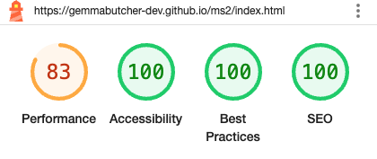
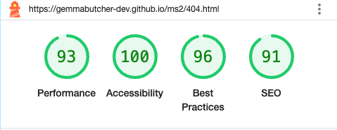
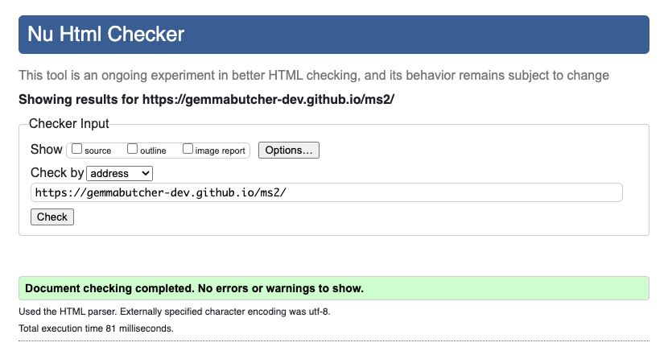
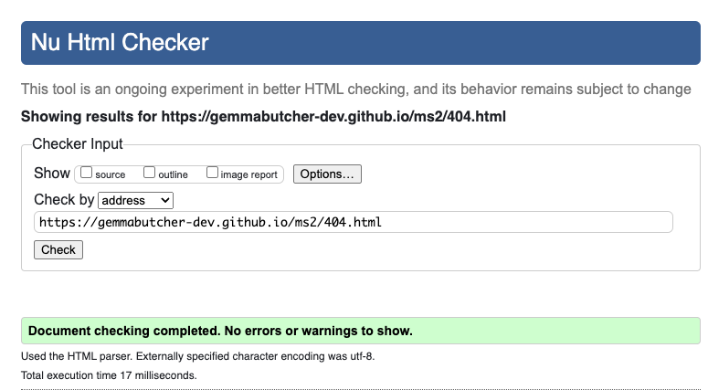
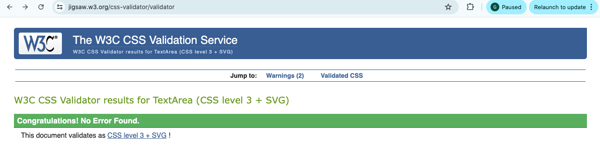

 #[Testing](#testing)

## Table of contents

  1. [Overall Peformance](#overall-performance)
  2. [Code Validation](#code-validation)
  3. [Accessibility Testing](#accessibility-testing)
  4. [JavaScript Testing](#javascript-testing)
  5. [Bug Fixes](#bug-fixes)
  6. [Testing User Stories from User Experience (UX) Section](#testing-user-stories)
        * Project Goals
        * Players Goals
        * Super Squad helps players meet these goals by:
  7. [Further Testing](#further-testing)

  ------

## Overall Performance

The complete site was tested on the lighthouse facility in Google Developer Tools to assess the overall performance of the site. The site meets the pass criteria and you can see the results in the below table.

| Page                | Screenshot                                      | Notes                                                        |
|---------------------|-------------------------------------------------|--------------------------------------------------------------|
|Start/Home Screen    | | Minor improvements for performance                           |
|404                  |   | No warnings. Possible minor improvements. 100% accessibility |

## Code Validation

The W3C Markup Validator and W3C CSS Validator Services were used to validate every page of the project to ensure there were no syntax errors in the project. The results and screenshots are in the table below.

| Page                | Screenshot                               | Notes  |
|---------------------|------------------------------------------|--------|
|Start/Home Screen    | | Passed |
|404                  |   | Passed | 
|CSS                  |   | Passed |

## Accesibility Testing

    * The complete site was tested using [Web Aim](https://wave.webaim.org/) and has passed. This can be [viewed here for index.html](docs/testing/webaim.png) and [viewed here for 404.html](docs/testing/webaim_404.png). There was a minor warning where the icon was being detected as a h2, although not being used or labelled as a h2.

## JavaScript Testing

## Bug Fixes

## Testing User Stories from User Experience (UX) Section

## Further Testing

    * The Website was tested on Google Chrome, Internet Explorer, Microsoft Edge and Safari browsers.
    * The website was viewed on a variety of devices such as Desktop, Laptop, iPhone7, iPhone 8 & iPhoneX.
    * A large amount of testing was done to ensure that all pages were linking correctly.
    * Friends and family members were asked to review the site and documentation to point out any bugs and/or user 
      experience issues.
